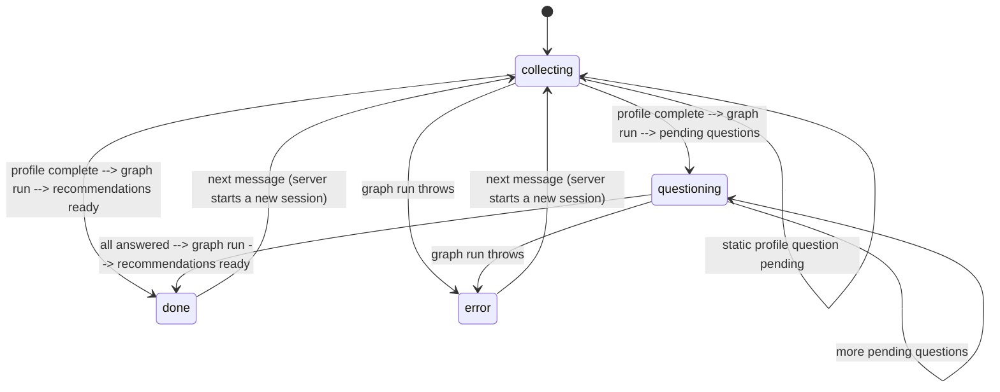
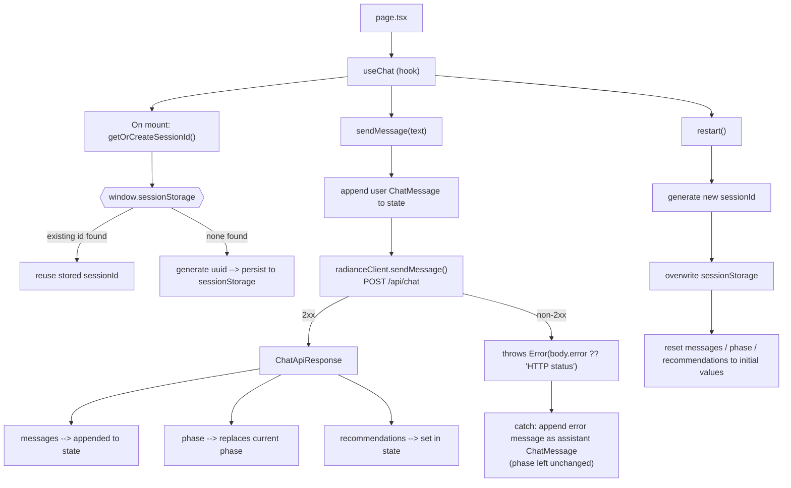

# Radiance AI Frontend

A Next.js-based frontend for the Radiance AI platform — a conversational, AI-powered interface that guides users through a structured dialogue to deliver personalised cosmetic product recommendations. The application coordinates chat sessions with a backend AI agent and presents ranked, safety-annotated product results.

---

## Table of Contents

- [Architecture Overview](#architecture-overview)
- [Folder Structure](#folder-structure)
- [Component Reference](#component-reference)
- [State Management and Data Flow](#state-management-and-data-flow)
- [API Integration](#api-integration)
- [Authentication](#authentication)
- [UI Framework](#ui-framework)
- [Key Technologies](#key-technologies)
- [Setup and Installation](#setup-and-installation)
- [Environment Variables](#environment-variables)
- [Development](#development)
- [Production Build](#production-build)
- [Linting](#linting)
- [Troubleshooting](#troubleshooting)

---

## Architecture Overview

The frontend is a **Next.js 14 App Router** application rendered on the client. It follows a single-session chat pattern: the user engages in a structured question-and-answer flow that the backend AI processes before returning ranked product recommendations.

**Routing:** Next.js file-based routing via `src/app/`. The application is a single-route experience — navigation is state-driven. Phase transitions (`collecting`, `questioning`, `processing`, `done`, `error`) control what is rendered rather than URL changes. No client-side router library is used.

**State management:** A single custom hook, `useChat`, encapsulates session lifecycle, message history, phase tracking, and recommendation results. No third-party state management library is used.

**API integration:** All backend communication is centralised in `src/services/radianceClient.ts`, which exposes a typed async function over a single `POST /api/chat` endpoint. The base URL is injected via an environment variable at build time.

**Authentication:** No authentication layer is implemented. Session continuity is maintained by a client-generated UUID (`sessionId`) passed with every request.

---

## Folder Structure

```
radiance-ai-frontend/
├── src/
│   ├── app/                        # Next.js App Router: layouts, pages, global styles
│   │   ├── globals.css             # Tailwind directives and global CSS custom properties
│   │   ├── layout.tsx              # Root layout: HTML shell, metadata, background
│   │   └── page.tsx                # Home page: chat shell, scroll behaviour, phase rendering
│   ├── components/                 # Presentational UI components
│   │   ├── InputBar.tsx            # Textarea input with Enter-to-send keyboard handling
│   │   ├── MessageBubble.tsx       # Role-differentiated chat message renderer
│   │   └── RecommendationCard.tsx  # Ranked product card with safety and relevance data
│   ├── hooks/                      # Encapsulated stateful logic
│   │   └── useChat.ts              # Session state, message list, phase machine, API calls
│   ├── services/                   # External API communication layer
│   │   └── radianceClient.ts       # HTTP client, request/response types, sendMessage()
│   └── types/                      # Shared TypeScript type definitions
│       └── chat.ts                 # Re-exports all domain types from radianceClient
├── next.config.js                  # Next.js configuration (currently default)
├── tailwind.config.ts              # Tailwind content paths and custom colour palette
├── tsconfig.json                   # TypeScript compiler options (strict, path aliases)
├── postcss.config.js               # PostCSS plugins: tailwindcss, autoprefixer
└── package.json                    # Dependencies, scripts, project metadata
```

**`src/app/`** — The App Router root. `layout.tsx` defines the persistent HTML shell and page metadata. `page.tsx` is the sole route, consumes `useChat`, manages the scroll reference, and composes the chat UI.

**`src/components/`** — Presentational components that accept typed props and render a specific piece of the UI. Business logic is absent from this layer.

**`src/hooks/`** — `useChat` is the primary orchestrator of runtime behaviour, bridging the service layer and the view layer.

**`src/services/`** — HTTP communication is isolated here. The service layer owns the request shape, response types, and error propagation. Components and hooks never call `fetch` directly.

**`src/types/`** — Re-exports domain types from `radianceClient.ts` to provide a stable import path for consumers that should not depend on service internals.

---

## Component Reference

### `InputBar`

Renders a resizable `<textarea>` for user input.

| Prop | Type | Required | Description |
|------|------|----------|-------------|
| `onSend` | `(text: string) => void` | Yes | Callback invoked with trimmed input on submission |
| `disabled` | `boolean` | No | Disables input and button during loading |
| `placeholder` | `string` | No | Placeholder text for the textarea |

`Enter` submits; `Shift+Enter` inserts a newline. Empty or whitespace-only inputs are rejected before the callback fires.

---

### `MessageBubble`

Renders a single chat message with role-based visual differentiation.

| Prop | Type | Required | Description |
|------|------|----------|-------------|
| `message` | `ChatMessage` | Yes | Message object with `id`, `role`, `content`, `timestamp` |

User messages are right-aligned with a rose background. Assistant messages are left-aligned with a white card background. Whitespace within `content` is preserved via `whitespace-pre-wrap`.

---

### `RecommendationCard`

Renders a product recommendation result with safety annotation and relevance context.

| Prop | Type | Required | Description |
|------|------|----------|-------------|
| `rec` | `RecommendationResult` | Yes | Recommendation data from the API |
| `rank` | `number` | Yes | 1-based display rank |

Displays: rank badge, product name, brand, safety status (`safe` / `caution` / `unsafe`), relevance explanation, usage tips, safety notes (caution state only), category tags, and an optional external product link.

---

## State Management and Data Flow

All runtime state is managed by `useChat` (`src/hooks/useChat.ts`).

### State Shape

| Field | Type | Description |
|-------|------|-------------|
| `messages` | `ChatMessage[]` | Ordered conversation history |
| `phase` | `ChatPhase` | Current session phase |
| `recommendations` | `RecommendationResult[]` | Products returned on completion |
| `isLoading` | `boolean` | True while an API request is in-flight |
| `sessionId` | `string` (ref) | UUID persisted in `sessionStorage` — survives page refresh, resets on `restart()` |

### Phase Transitions



The backend drives phase transitions — each API response carries a `phase` field that the hook applies to local state. `'processing'` exists in the `ChatPhase` type but the backend never actually returns it in a response (`chatService.ts` only ever resolves to `collecting`/`questioning`/`done`/`error` before replying); the loading UI is driven entirely by the client-side `isLoading` flag instead. `phase === 'done'` conditionally renders the "New search" button and changes the input placeholder. Reaching `done` or `error` isn't a dead end — sending another message from either phase causes the backend to transparently start a new session and reply with `phase: 'collecting'`, without the client needing to call `restart()` first.

### Data Flow



The hook initialises with a welcome `ChatMessage` from the assistant and `phase: 'collecting'`. The `sessionId` is read from `window.sessionStorage` on first mount (falling back to a freshly generated `uuid` if none is stored) and held in a `useRef` to survive re-renders without triggering state updates. Persisting it in `sessionStorage` means a page refresh resumes the same backend session instead of starting a new one; `restart()` generates a new ID and overwrites the stored value.

---

## API Integration

### Base URL

```
NEXT_PUBLIC_API_URL (default: http://localhost:3001)
```

Configured in `.env.local`. The `NEXT_PUBLIC_` prefix causes Next.js to inline the value at build time, making it available in the browser bundle.

### Endpoint

```
POST /api/chat
Content-Type: application/json
```

### Request

```typescript
interface ChatRequest {
  sessionId: string;
  message: string;
}
```

### Response

```typescript
interface ChatApiResponse {
  messages: ChatMessage[];
  phase: ChatPhase;
  recommendations?: RecommendationResult[];
  error?: string;
}
```

### Domain Types

```typescript
type ChatPhase = 'collecting' | 'questioning' | 'processing' | 'done' | 'error';

interface ChatMessage {
  id: string;
  role: 'user' | 'assistant';
  content: string;
  timestamp: string;
}

interface RecommendationResult {
  name: string;
  brand: string;
  categories: string[];
  countryAvailability: string[];
  sourceUrl?: string;
  safetyStatus: 'safe' | 'caution' | 'unsafe';
  safetyNotes?: string;
  relevanceScore: number;
  availabilityNotes?: string;
  relevanceToQuery?: string;
  reasoning?: string;
  usageTips?: string[];
}
```

### Error Handling

`radianceClient.sendMessage()` throws if the HTTP response status is not in the 2xx range. It attempts to parse the response body and use the backend's `error` field as the thrown message, falling back to a generic `HTTP <status>` string only if the body isn't valid JSON. `useChat` catches this and appends the error's message (or a generic fallback string if it isn't an `Error`) to the chat as an assistant message — `phase` is left unchanged, since the backend never got a chance to report one.

---

## Authentication

No authentication is implemented. The backend identifies sessions using the `sessionId` UUID generated client-side.

---

## UI Framework

Styling is implemented entirely through Tailwind CSS utility classes. A custom rose colour palette is defined in `tailwind.config.ts`:

| Token | Usage |
|-------|-------|
| `rose-50` | Page background |
| `rose-100` | Light accents, border highlights |
| `rose-500` | Primary brand colour, buttons |
| `rose-600` | Hover state |

Global styles in `globals.css` are limited to Tailwind directives, CSS custom properties for theme tokens, and `scroll-behavior: smooth` for the chat container. No CSS Modules or styled-components are used.

---

## Key Technologies

| Technology | Version | Role |
|------------|---------|------|
| Next.js | 14.2 | Application framework, App Router, build pipeline |
| React | 18.3 | UI component model |
| TypeScript | 5.4 | Static typing across all source files |
| Tailwind CSS | 3.4 | Utility-first styling |
| uuid | 10.0 | Client-side session ID generation |
| ESLint | 8.57 | Static analysis via `eslint-config-next` |
| PostCSS / Autoprefixer | 8.x / 10.x | CSS transformation and vendor prefixing |

---

## Setup and Installation

**Prerequisites:**
- Node.js >= 18.17.0
- npm >= 9.x
- A running instance of the Radiance AI backend

```bash
git clone <repository-url>
cd radiance-ai-frontend
npm install
```

---

## Environment Variables

Create `.env.local` in the project root (excluded from version control by `.gitignore`):

```
NEXT_PUBLIC_API_URL=http://localhost:3001
```

| Variable | Required | Description |
|----------|----------|-------------|
| `NEXT_PUBLIC_API_URL` | Yes | Base URL of the Radiance AI backend |

After editing `.env.local`, restart the development server — Next.js reads environment files at startup.

---

## Development

```bash
npm run dev
```

Available at `http://localhost:3000`. The browser calls `NEXT_PUBLIC_API_URL` directly; no proxy is configured.

---

## Production Build

```bash
npm run build   # compiles and optimises, outputs to .next/
npm start       # starts the production server on port 3000
```

---

## Linting

```bash
npm run lint         # runs next lint (eslint-config-next rules)
npx tsc --noEmit     # standalone type check
```

---

## Troubleshooting

### `fetch` fails with a CORS error

The backend must include CORS headers permitting the frontend origin:

```
Access-Control-Allow-Origin: http://localhost:3000
Access-Control-Allow-Methods: POST, OPTIONS
Access-Control-Allow-Headers: Content-Type
```

Ensure `NEXT_PUBLIC_API_URL` in `.env.local` exactly matches the backend address (protocol, host, port).

### Environment variable is `undefined` at runtime

- Confirm the variable is prefixed with `NEXT_PUBLIC_`.
- Confirm the file is named `.env.local`.
- Restart the development server after any change to `.env.local`.

### TypeScript errors after pulling changes

```bash
rm -rf .next
npm run build
```

Stale `.next` cache can produce spurious type errors in the dev server.

### `Module not found` for `@/` path aliases

`tsconfig.json` must contain:

```json
{
  "compilerOptions": {
    "paths": {
      "@/*": ["./src/*"]
    }
  }
}
```

Next.js reads this automatically; no additional Webpack configuration is required.

### Development server port conflict

```bash
npm run dev -- -p 3001
```
